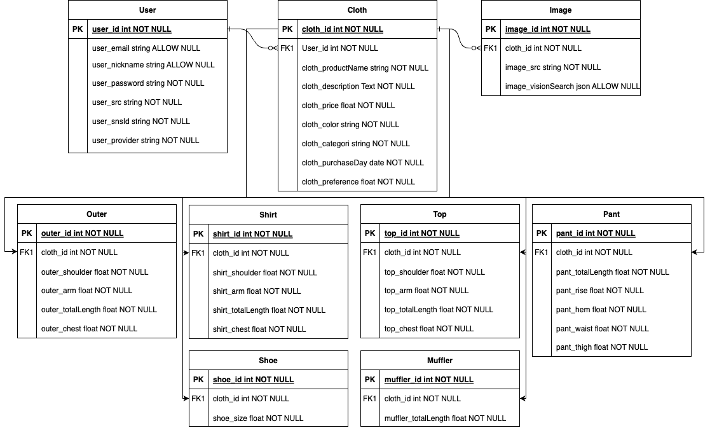
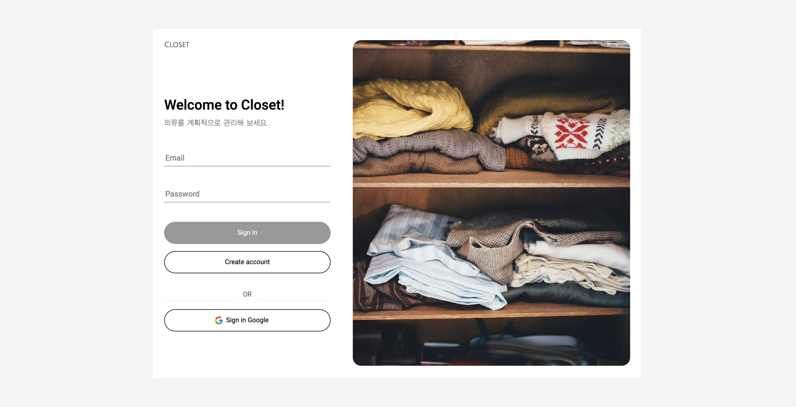
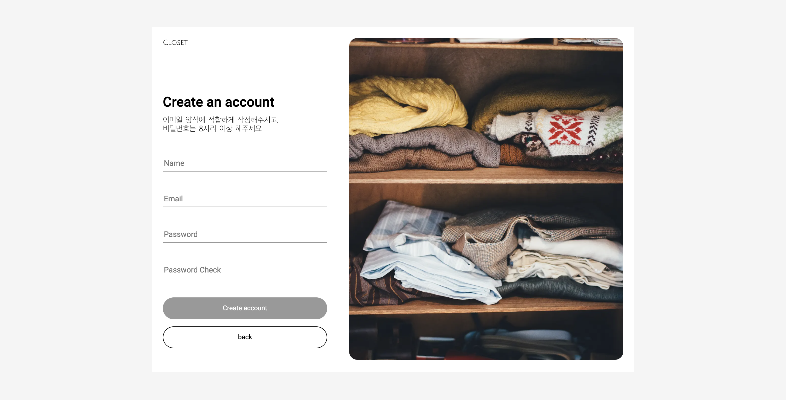

<h1 align="center">CLOSET</h1>
<h3 align="center"> 옷장 의류를 웹에서 관리해봅시다 </h3> 
 

- 프로젝트 명 : 클로젯(Closet)
- 팀 원 : 최원익(Front), 최원익(Back)
   

<h2 id="프로젝트소개"> :book: 프로젝트 소개</h2>

가정 옷장의 자신의 의류들의 재고, 사이즈, 종류별 비율 등 한눈에 쉽게 파악할 수 있도록 도와주는 프로젝트 입니다  
많은 사람들이 인터넷 쇼핑몰을 적극 활용해서 쇼핑을 하고 있고, 수많은 광고와 브랜드의 신상품이 쏟아지는 상황 속 자칫 계획에 없던 소비가 이뤄질 수 있습니다. 현재 자신이 소유하는 의류들을 쉽게 파악하고, 이를 통해 계획적이고 합리적인 쇼핑을 할 수 있도록 도와줍니다.
 
 
현재 배포된 사이드 프로젝트는 개인 대시보드 구조로서 로그인 및 회원가입, 전체 요약 페이지(Overview), 목록 페이지(Store), 의류 저장 페이지(Add), 의류 상세 페이지(Details) 까지 구현이 되어있습니다.   추후 검색기능, 데이터 차트 페이지, 회원정보 페이지 외 필요사항들을 업데이트 해나갈 예정입니다.

 

<h2 id="팀원 소개"> :dart: 개발 기간 및 팀원</h2>

- 개발 기간 : 2023/2/1 ~ 2023/4/30 (3개월)
- 개발 인원 : 1명(Front, Back)
  - FE : 최원익
  - BE : 최원익
     

<h2 id="사용 기술"> :fork_and_knife: Skills</h2>

### Front-end

      

### Back-end

      

### Deploy

   
 

<h2 id="주소"> :cactus: URL</h2>

[https://closet-online.com](https://closet-online.com)
 

<h2 id="구현목표"> :floppy_disk: 구현 사항 요약</h2>

- 웹과 어플리케이션의 사용성을 고려하여 반응형 레이아웃 구축 & 대시보드 레이아웃
- 로컬 회원가입과 Google Auth 소셜 로그인 도입을 위한 passport 설정
- 의류 입력값을 기입하여 서버에 데이터베이스에 저장하기 위한 Add 페이지 구현(React-hook-form)
- 사진 업로드 시 의류 카테고리에 적합한 사진인지 분석하기 위한 Google Vision AI 도입
- 수정 및 삭제가 가능한 의류 상세 페이지 구현(Swiper)
- 디바이스에 따라 저장된 의류 목록 페이지내이션 구별(모바일 - infiniti scroll, 데스크탑 - Table)
- 불필요한 중복 서버 요청을 막기 위해 SWR data cache 활용
- SWR mutate 를 활용하여 Store 의류 데이터 삭제 시 cache 최신화
- scroll 이벤트 구독 시 과도한 호출이 발생할 수 있어, Intersection Observer 를 통한 무한스크롤 구축
- 데이터 로딩 시 사용자 경험 상승을 위한 Skeleton UI 구축
   

<h2 id="담당하였던part"> :large_blue_diamond: ERD</h2>
 

 

<h2 id="추가기능"> :large_blue_diamond: 구현페이지</h2>
 

> **Login**

 

> **회원가입**

 

> **Overview**

 

> **Store**

 

> **Add**

 

> **Details**

 

